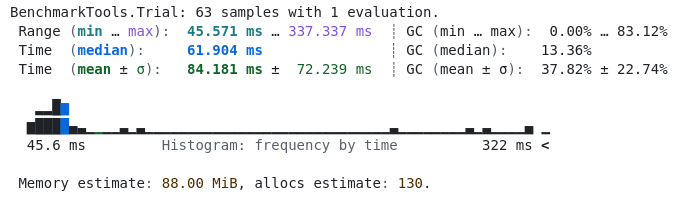
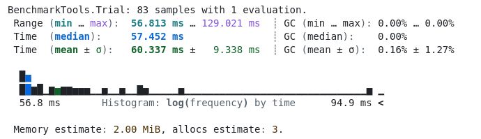
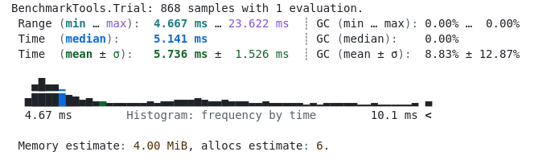
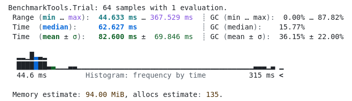
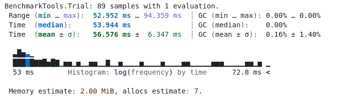
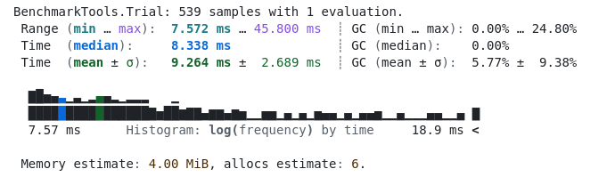
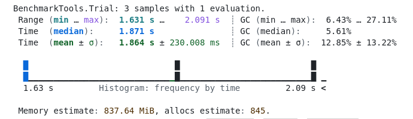
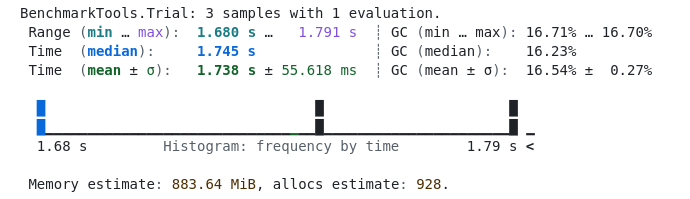

# Benchmark

Nesta seção, apresentamos os testes de desempenho realizados para avaliar a eficiência de diferentes implementações de funções e resolução de sistemas lineares. Os testes foram divididos em **funções seriais** (execução tradicional sem paralelização) e **funções vetorizadas** (uso de operações vetorizadas para maior eficiência).

---

## Teste Independente de Funções: Seriais

Os benchmarks abaixo representam os resultados da execução das funções na forma **serial**. Nesse contexto, as funções são implementadas de maneira tradicional, sem uso de técnicas avançadas de vetorizações ou paralelismo.

### Benchmark `K_serial`

Este teste avalia o desempenho da função `K` na implementação serial.

### Benchmark `F_serial`

Neste teste, analisamos o comportamento da função `F` na forma serial.

### Benchmark `G_serial`

O gráfico a seguir demonstra o desempenho da função `G` quando executada serialmente.

---

## Teste Independente de Funções: Vetorizados

Nesta subseção, apresentamos os resultados dos benchmarks para as funções **vetorizadas**. A vetorização permite um processamento mais eficiente ao operar sobre blocos de dados simultaneamente, reduzindo a necessidade de loops explícitos.

### Benchmark `K_vectorized`

O teste de desempenho da função `K` na implementação vetorizada é mostrado abaixo.

### Benchmark `F_vectorized`

Abaixo, avaliamos o desempenho da função `F` em sua forma vetorizada.

### Benchmark `G_vectorized`

Aqui, apresentamos o resultado do benchmark para a função `G` com implementação vetorizada.

---

## Teste do Sistema Linear

Para resolver o sistema linear, realizamos benchmarks comparando duas abordagens: **laço explícito** (serial) e **vetorizada**. O objetivo é analisar a diferença de desempenho ao utilizar técnicas de vetorizações para otimização.

### Laço Explícito

Neste teste, utilizamos a abordagem tradicional com laços explícitos para resolver o sistema linear.

### Vetorizado

Nesta abordagem, utilizamos técnicas de vetorizações para resolver o sistema linear de forma otimizada.

