### 1. Introdução e Formulação do Problema

Dados $\alpha > 0$, $\beta, \gamma \geq 0$ constantes reais e funções $f: [0, 1] \times [0, T] \rightarrow \mathbb{R}$, $u_0: [0, 1] \rightarrow \mathbb{R}$ e $g: \mathbb{R} \to \mathbb{R}$, determine $u: [0, 1] \times [0, T] \to \mathbb{R}$ tal que:

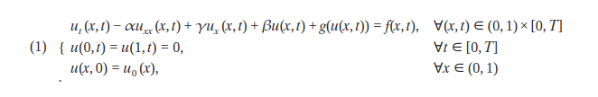

Sejam considerados os conjuntos:

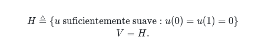

$H$ é denominado espaço das soluções do problema e $V$ é denominado espaço das funções testes. O primeiro passo que iremos fazer é multiplicar ambos os lados da Equação Diferencial Ordinária (\ref{edo}) por uma função $v(x) \in V$:

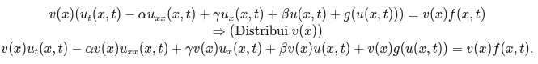

Agora integramos ambos os lados no intervalo $x \in [0, 1]$ e aproveitamos para reduzir a ordem da derivada de $u$:

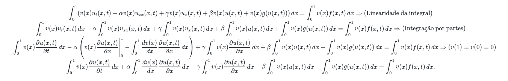

Nesse formato, o problema possui apenas derivadas de primeira ordem, relaxando a necessidade da função $u$ ser duas vezes diferenciável em todo o seu domínio. Esse formato é denominado **Formulação Fraca** e será devidamente definido a seguir.

### 2. Formulação Fraca do Problema:

Dados $\alpha > 0$, $\beta, \gamma \geq 0$ constantes reais e funções funções $f: [0, 1] \times [0, T] \rightarrow \mathbb{R}$ e $u_0: [0, 1] \rightarrow \mathbb{R}$, determine $u: [0, 1] \times [0, T] \to \mathbb{R}$ tal que:

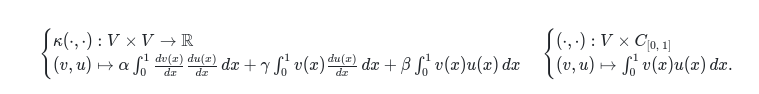

Será utilizada a seguinte notação:

Em que $C_D \triangleq \{f: \mathbb{D} \to \mathbb{R}| f \text{ é contínua em todo domínio} D\}$. Nosso problema é então descrito por:

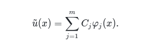

Note que no problema definido em (\ref{notacao}), as funções transientes estão fixadas em um determinado tempo $t$. O próximo passo é aproximar o espaço $V$ por um espaço $V_m \triangleq \{\sum^m_{j=1}C_j\varphi_j(x): C_j \in \mathbb{R}, j = 1,\ 2,\ \ldots,\ m\}$, em que as funções $\varphi_i$, $\forall i \in \{1,\ 2,\ \ldots,\ m\}$, formam uma base para um subespaço finito das funções teste $V$. Vamos considerar a seguinte função construída como combinação linear das funções da base do subespaço finito:

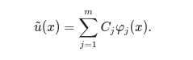

Essa será a função que utilizaremos para resolver numericamente o problema no espaço. Agora podemos passar para um problema aproximado que será definido logo abaixo.

### 3. Problema Semi-discreto - Via Método de Galerkin na Variável Espacial:

Dados $\alpha > 0$, $\beta, \gamma \geq 0$ constantes reais e funções funções $f: [0, 1] \times [0, T] \rightarrow \mathbb{R}$ e $\tilde{u}_0 \in V_m$ uma aproximação para $u_0$, determine $\tilde{u}(t) \in V_m, t \in [0,\ T]$ tal que:

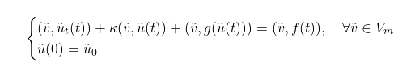

Queremos determinar $\tilde{u}(t)$, isto é, queremos determinar os coeficientes $C_i$, $\forall i \in \{1,\ 2,\ \ldots,\ m\}$ tal que $\tilde{u}(t)$ satisfaça (\ref{galerkin}). Porém, a nossa definição de $\tilde{u}(x)$ não depende do tempo. A estratégia é definir um conjunto de funções $\tilde{u}^{(n)}(x)$, em que teremos que determinar as componentes do vetor $C^{(n)}$ para cada tempo $t_n$. Primeiro, vamos fazer uma aproximação de ordem quadrática para a derivada $\tilde{u}_t(t_{n-\frac{1}{2}}) \approx \frac{\tilde{u}(t_{n}) - \tilde{u}(t_{n-1})}{\tau}$ (Método Crank-Nicolson), em que $t_{n-\frac{1}{2}} = \frac{t_n + t_{n-1}}{2}$, e discretizar o domínio do tempo uniformemente a partir de um passo $\tau \in \mathbb{R^+}$ de modo que $0 = t_0 < t_1 < \ldots < t_N \leq T, t_n = n\tau\ \forall n \in \{0,\ \ldots,\ N\}$. Nosso problema totalmente discreto é definido a seguir.

### 4. Problema Totalmente Discreto - Galerkin no Espaço e Crank-Nicolson no Tempo:

Dados $\alpha > 0$, $\beta, \gamma \geq 0$ constantes reais e funções funções $f: [0, 1] \times [0, T] \rightarrow \mathbb{R}$ e $\tilde{u}_0 \in V_m$ uma aproximação para $u_0$, determine $U^{(n)} \in V_m$ tal que:

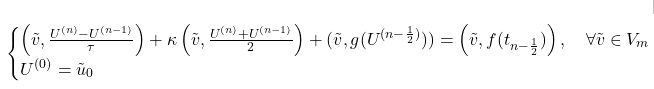

Para $U^{(n)} := \tilde{u}(t_n)$, $\tilde{u}(t_{n - \frac{1}{2}}) \approx \frac{U^{(n)} + U^{(n-1)}}{2}$, $0 = t_0 < t_1 < \ldots < t_N \leq T, t_n = n\tau\ \forall n \in \{0,\ \ldots,\ N\}$ e $t_{n-\frac{1}{2}} = \frac{t_n + t_{n-1}}{2}$. Tendo em vista que $\tilde{v} \in V_m$, em particular, $\tilde{v}$ pode ser uma das funções da base. Essa escolha irá ser de grande ajuda para determinar os coeficientes de $U^{(n)}(x) = \sum^m_{j=1}C^{(n)}_j\varphi_j(x)$, como veremos a seguir:

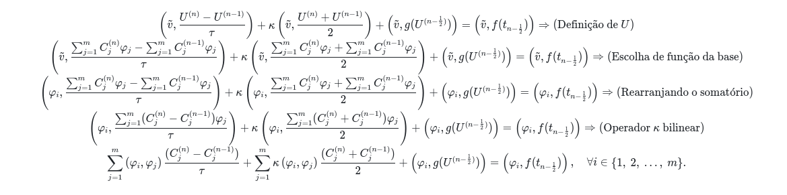

### 5. Lidando com a Função Não-linear g(s) (Linearizando com Ordem Quadrática):

Vamos utilizar a aproximação $U^{(n-\frac{1}{2})} \approx \frac{3U^{(n-1)} - U^{(n-2)}}{2}$ para obter a seguinte equação:

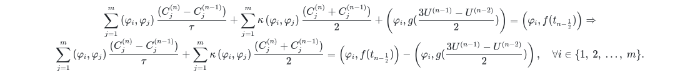

Podemos montar um sistema linear $m\times m$ para um vetor $C^{(n)}_{1\times m}$ de incógnitas descrito a seguir.

### 6. Formulação Matricial:

Vamos considerar a última equação acima para $i = 1,\ 2,\ \ldots,\ m$:

Sendo assim, matricialmente, temos que:

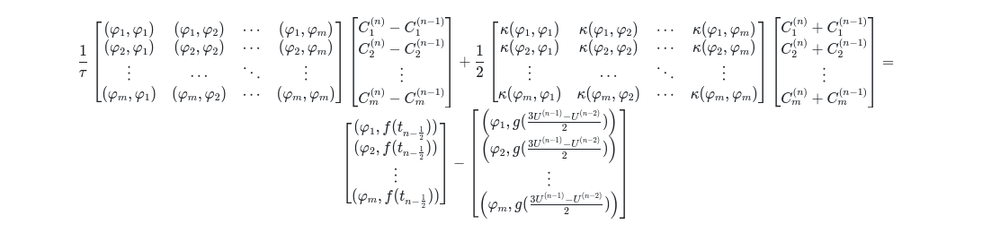

Reescrevendo a equação acima, temos o seguinte sistema linear:

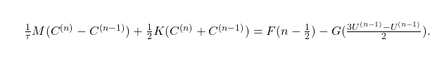

Para $M_{ij} = (\varphi_i, \varphi_j)$, $K_{ij} = \kappa(\varphi_i, \varphi_j)$, $F_i(n - \frac{1}{2}) = (\varphi_i, f(t_{n - \frac{1}{2}}))$ e $G_i(\frac{3U^{(n-1)} - U^{(n-1)}}{2}) = \left(\varphi_i, g(\frac{3U^{(n-1)} - U^{(n-2)}}{2})\right)$.

### 7. Implementação:

Estamos utilizando uma função linear para $\varphi_i(x)$ definida por:

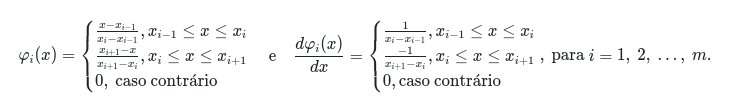

Em que $x_i = a + i(x_{i} - x_{i-1}) = a + ih_i$ e $h_i = x_{i} - x_{i-1}$, para $i = 1,\ 2,\ \ldots,\ m$. Como as partições são uniformes, $h_i = h$ é constante. **Uma consideração importante é que estaremos utilizando uma extensão dos vetores e das matrizes para $m+1$ ao invés de $m$ para manter a escrita das equações mais limpa e facilitar o uso das estruturas locais e globais**. As matrizes $M$ e $K$, e os vetores de termos independentes $F(n-\frac{1}{2})$ e $G(U)$ são calculados a partir da aproximação das respectivas integrais por quadratura gaussiana (notação local):

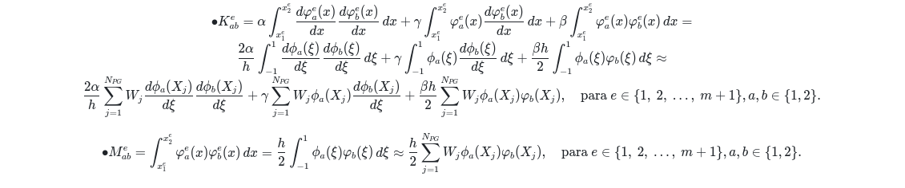

Em que $\phi_1(\xi) = \frac{1 - \xi}{2}$ e $\phi_2(\xi) = \frac{1 + \xi}{2}$, $X_j$ e $W_j$, para $j = 1,\ 2,\ \ldots,\ N_{PG}$ são os pontos e pesos de Gauss, respectivamente, $N_{Pg}$ é o número de pontos de Gauss, e $x^e_{1} = x_{e-1}$ e $x^e_{2} = x_{e}$ (pontos começando de $0$ até $m+1$, com $m$ pontos internos).

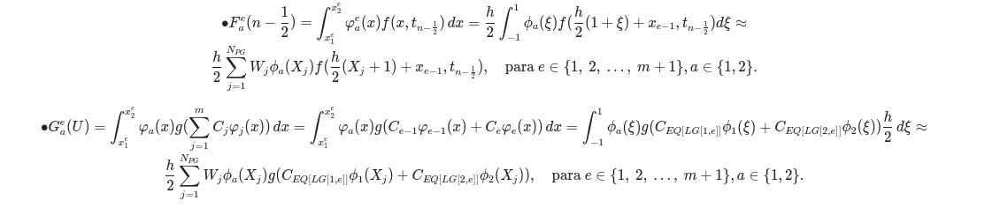

Vamos considerar as seguintes estruturas para mapear os elementos locais para os elementos globais:

Portanto:
\begin{align}
M*{EQ[LG[a, e]], EQ[LG[b, e]]} &\gets M^e*{ab} \\
K*{EQ[LG[a, e]], EQ[LG[b, e]]} &\gets K^e*{ab} \\
F*{EQ[LG[a, e]]} &\gets F^e_a \\
G*{EQ[LG[a, e]]} &\gets G^e_a
\end{align}

O erro entre a solução aproximada e a solução exata é dado por:

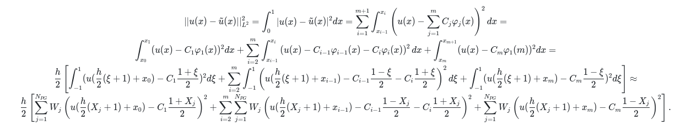

### 8. Aproximação de $u_0$ - Escolhas de $U^{(0)} \in V_m$:

#### 8.1 $U^0$ como interpolante de $u_0$:

A primeira escolha é dada pela interpolante de $u_0$. Temos que:

Sendo assim:

#### 8.2 $U^0$ como projeção $L^2$ de $u_0$:

Seja $U^0 \in V_m$ tal que:

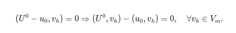

Tomando $U^0(x) = \sum^m_{j=1}C^0_j\varphi_j(x)$ e $v_h = \varphi_i$, para $i = 1,\ 2,\ \ldots,\ m$, na equação acima, temos que:

#### 8.3 $U^0$ como projeção $H^1_0$ de $u_0$:

Seja $U^0 \in V_m$ tal que:

Tomando $U^0(x) = \sum^m_{j=1}C^0_j\varphi_j(x)$ e $v_h = \varphi_i$, para $i = 1,\ 2,\ \ldots,\ m$, na equação acima, temos que:

O lado direito pode ser obtido a partir das seguintes equações:

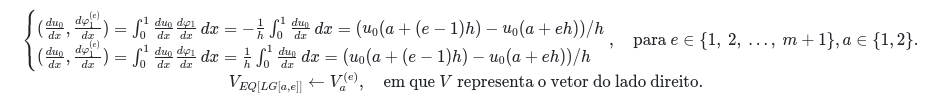

#### 8.4 Utilizando o operador $\kappa(\cdot, \cdot)$ para realizar a projeção de $u_0$:

Seja $U^0 \in V_m$ tal que:

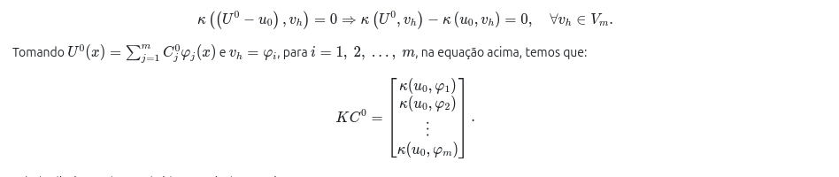

O lado direito pode ser obtido a partir das seguintes equações:

### 9. Determinando $U^{(1)}$ - Método Preditor-Corretor:

Precisamos determinar $U^{(1)}$ para poder utilizar a relação de recorrência da forma matricial do problema. Para isso, vamos utilizar um método preditor-corretor que em um passo nos dá uma aproximação no tempo $t_1$ a partir das duas seguintes etapas:

#### (i) Etapa 1:

Definimos $\tilde{U}^{(1)} \in V_m$ como solução do seguinte problema:

#### (ii) Etapa 2:

Determinamos uma aproximação para $U^{(1)} \in V_m$ que é a solução do seguinte problema:

## Comparando Solução Exata e Aproximada: Caso serial

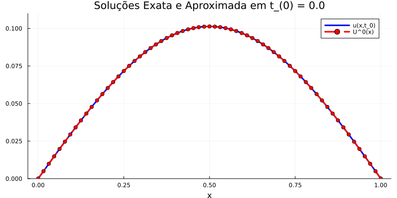

## Comparando Solução Exata e Aproximada: Caso vetorizado

